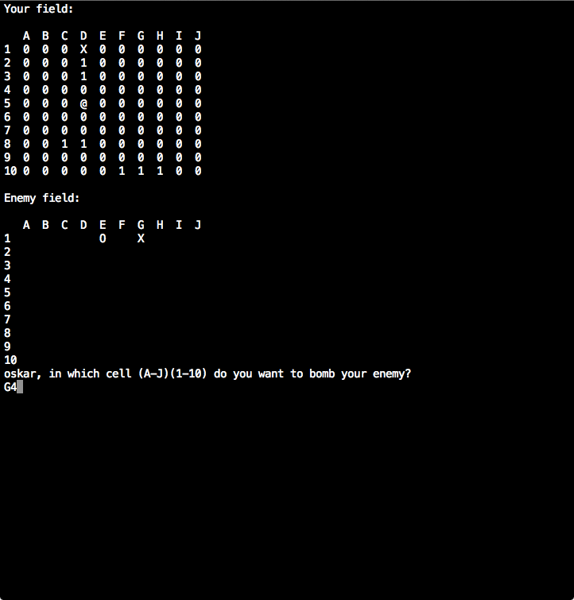

## Table of Contents

* [About the Project](#about-the-project)
* [Roadmap](#roadmap)
* [License](#license)
* [Contact](#contact)

## About The Project

Battleship Game Engine (BGE) implements the classic turn-based board game as a package that's separated from any presentation layer. This is a type of architectural pattern that useful in many application since it allows any number of apps to utilize the same service.

The BGE itself is invoked through a series of function calls rather than through directly coupled end user actions. In this respect using the BGE is is similar to using an API or a series of routes exposed by a web server.

This challenge requires that you develop the BGE and a very thin, text-based presentation layer for testing that's separate from the engine itself. Due to this the User Stories below are divided two sets - one for the BGE and one for the text-based presentation layer.

BGE is responsible for maintaining game state.

This project come from [florinpop17](https://github.com/florinpop17/app-ideas/blob/master/Projects/3-Advanced/Battleship-Game-Engine.md)

## Roadmap

See the [open issues](https://github.com/remi-boivin/Battleship-Game-Engine/issues) for a list of proposed features (and known issues).

## License

The project is under GNU, v3.0. For more informations you can read the  [LICENCE.md](https://github.com/remi-boivin/Battleship-Game-Engine/blob/master/LICENSE) for more information about the GNU, v3.0 licence.

## Contact

[remi-boivin](https://github.com/remi-boivin) - [E-Mail](mailto:remi.boivin@epitech.eu)
